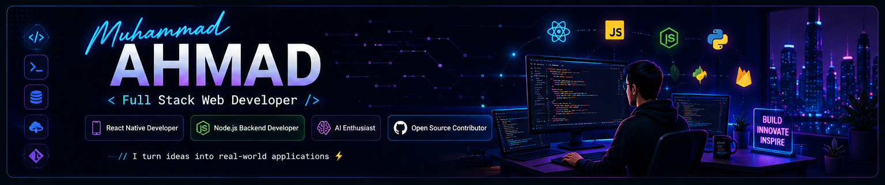

  

<h1 align="center">Hi 👋, I'm Muhammad Ahmad</h1>
<h3 align="center">Software Engineering Student | Full Stack Web Developer | React Native Developer</h3>

  

---

# 🚀 About Me

- 🔭 Currently working on **React Native** & **Full Stack Web Development**
- 🌱 Learning **React Native, Node.js, MongoDB, Firebase, Oracle APEX & Python**
- 👯 Looking to collaborate on **Open Source Projects**
- 🤝 Interested in **AI, Backend Development & System Design**
- 💬 Ask me about **HTML, CSS, JavaScript, React Native, SQL, Oracle APEX, Git & GitHub**
- ⚡ Fun Fact: **I enjoy turning ideas into real-world applications.**

---

# 🌐 Connect With Me

---

# 🛠️ Tech Stack

---

# 🚀 Featured Projects

<a href="https://github.com/Ahmadmalik1122/Task-Manager-React-Native">
<b>📱 Task Manager React Native</b>
</a>
 
React Native + Expo + Firebase
  

<a href="https://github.com/Ahmadmalik1122/CodeAlpha-Ecommerce-Store">
<b>🛒 CodeAlpha Ecommerce Store</b>
</a>
 
Node.js + Express.js + SQLite + JavaScript

# 📊 GitHub Stats

---

# 🏆 GitHub Trophies

---

# 📈 Contribution Graph

---

# ✍️ Random Dev Quote

---

# 🎓 Certifications

### 🏅 MongoDB Basics for Students
**MongoDB** · Issued August 2026

### 🤖 Google AI Professional Certificate
**Google (via Coursera)** · Issued July 2026
# 👀 Profile Views

---

# ☕ Support Me

---

# 🐍 Contribution Snake

---

<h3 align="center">
⭐ Thanks for visiting my profile! ⭐
</h3>

